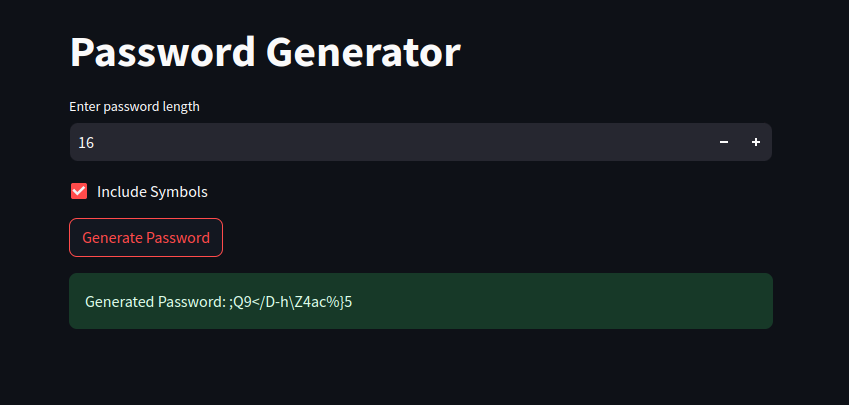

# Streamlit Password Generator

This project is a simple password generator built using Python and Streamlit, a web application framework. It provides a user-friendly interface to generate strong and secure passwords based on specified length and symbol preferences.

## Features

- **Customizable Length:** Users can specify the length of the password they need, ranging from 4 to 50 characters.
- **Symbol Inclusion:** An option to include symbols in the generated passwords for increased complexity.
- **Secure Generation:** Utilizes a combination of uppercase and lowercase letters, digits, and optionally, symbols to create robust passwords.

## How to Use

1. **Enter Password Length:** Adjust the desired length using the input field provided.
2. **Include Symbols:** Check the box if you want to include symbols in the generated password.
3. **Generate Password:** Click the button to generate a strong password based on the provided criteria.

This project serves as a simple demonstration of using Streamlit to create a functional and user-friendly password generation tool. Feel free to fork, modify, or enhance it for your specific needs!

## Usage

To run the app locally:
1. Clone the repository.
2. Install the required dependencies (`streamlit`).
3. Run the application using `streamlit run password_generator.py`.

https://huggingface.co/spaces/muhammadnasar/password_generator
